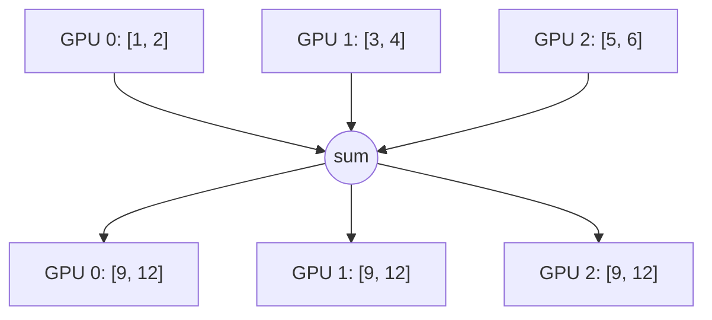
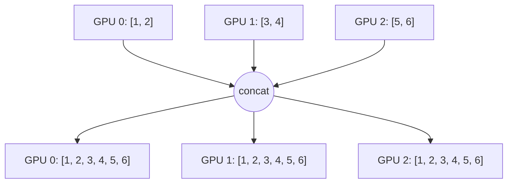
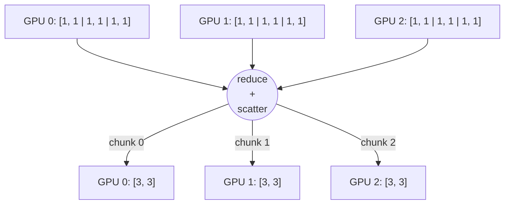
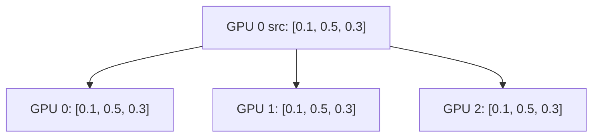
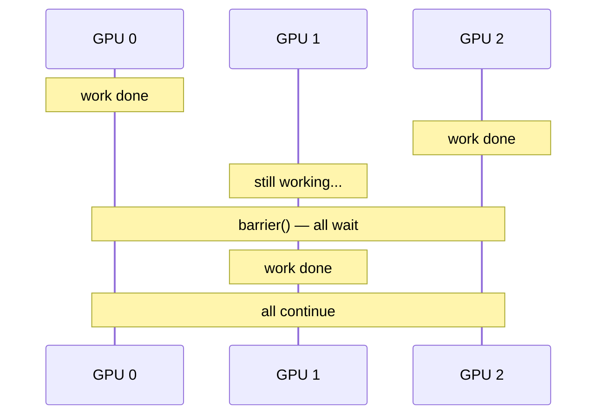
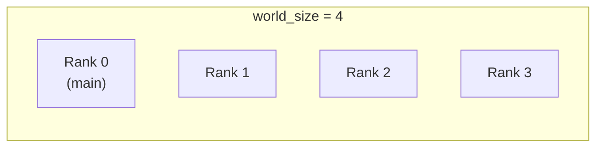
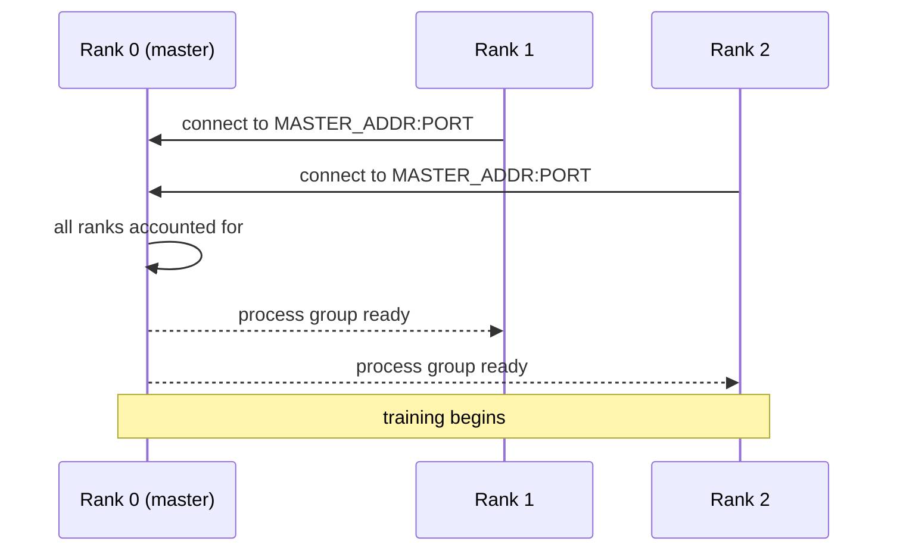
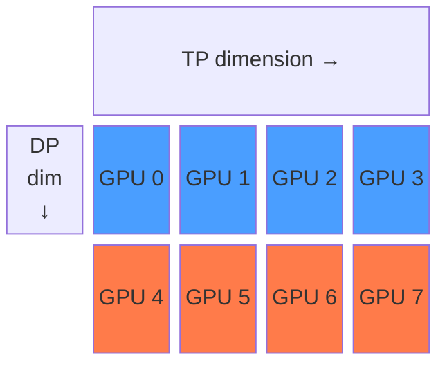

I spent a long time treating distributed training as a black box. I'd wrap my model in `DistributedDataParallel`, run `torchrun`, and hope for the best. It worked, until it didn't, and when it broke I had no mental model for *why*. So I decided to go back to the beginning and understand what's actually happening when multiple GPUs try to train a model together.

The answer starts with one constraint: GPUs **don't share memory**. That single fact shapes the entire design of distributed training. Every strategy you'll encounter in this series exists to make isolated devices communicate and coordinate.

This post covers the foundations: why distributed training is necessary, what strategies exist, how `torch.distributed` enables process communication, what collective operations move data between GPUs, and how to organize devices into structured groups. Everything that comes later in this series (Distributed Data Parallelism, Tensor Parallelism, Pipeline Parallelism) builds on these ideas.

> **tl;dr**
> - Models and datasets have outgrown single GPUs, so training must be split across multiple devices that can't see each other's memory
> - There are several parallelism strategies (data, tensor, pipeline, expert), each splitting the work differently
> - `torch.distributed` is PyTorch's communication layer, built on backends like NCCL that handle GPU-to-GPU transfers
> - Collective operations like **all-reduce** and **all-gather** are the verbs of distributed training, and every strategy is a different combination of these
> - Each process has a **rank** (its ID) and knows the **world size** (total processes), and as setups scale, GPUs get organized into structured **meshes**
{: .prompt-tip }

## Why distributed training

A single GPU trains a model by reading data from memory, running computations, computing gradients, and updating weights, all within the same device. For small models and datasets, that's all you need. I trained plenty of models this way and never thought twice about it.

Then the models got bigger. GPT-3 has 175 billion parameters. At 16-bit precision, that's around 350 GB just for the weights alone. A high-end GPU has 80 GB of memory. The model doesn't fit, and we haven't even accounted for optimizer states, activations, or gradients.

Even when the model does fit on a single GPU, training can be painfully slow. One device can only process so many samples per second. If your dataset has billions of tokens, you're looking at weeks or months of wall-clock time. Adding more GPUs lets you process more data in parallel and cut that time proportionally.

The catch is that GPUs are isolated. GPU 0 can't read a value from GPU 1's memory the way a CPU reads from RAM. Communication has to be explicit. Every distributed training strategy is a solution to this constraint: how do we split the work across devices that can't see each other's memory, and keep them coordinated?

## The landscape of parallelism strategies

There isn't one way to distribute training across GPUs. Different strategies split different things, and real training runs often combine several of them. Here's the map:

### Data Parallelism

Data Parallelism is the simplest and most common approach. Every GPU holds a full copy of the model, but each processes a different batch of data. After computing gradients, the GPUs average them so every copy stays in sync. This scales the effective batch size linearly with the number of GPUs. DDP (Distributed Data Parallel) is the standard implementation in PyTorch. A more memory-efficient variant is **FSDP (Fully Sharded Data Parallelism)**, which shards not just data but also model parameters, gradients, and optimizer states across GPUs. Each device holds only a fraction of the full training state and gathers what it needs on demand.

{: .rounded-10 .shadow w="600" }
_Each GPU holds a full model copy and processes a different mini-batch. Gradients are averaged via all-reduce so every replica stays in sync._

### Tensor Parallelism

Tensor Parallelism splits individual layers across GPUs. Instead of each GPU holding a full weight matrix, the matrix is sliced so each GPU holds a shard. The GPUs communicate during every forward and backward pass to combine partial results. This is how you train models where a single layer is too large for one device.

{: .rounded-10 .shadow w="600" }
_A single layer's weight matrix is sliced across GPUs. Each device computes a partial result and they communicate every forward/backward pass._

### Pipeline Parallelism

Pipeline Parallelism splits the model by depth. GPU 0 runs layers 1-10, GPU 1 runs layers 11-20, and so on. Data flows through like an assembly line. The challenge is keeping all GPUs busy: naive pipelining leaves most devices idle while one finishes its micro-batch.

{: .rounded-10 .shadow w="600" }
_The model is split by depth: GPU 0 runs the first layers, GPU 1 the next, and so on. Micro-batches flow through like an assembly line._

### Expert Parallelism

Expert Parallelism is specific to Mixture-of-Experts (MoE) models, where only a subset of "expert" sub-networks activate for each input. Different experts live on different GPUs, and a routing mechanism decides which expert handles each token.

{: .rounded-10 .shadow w="600" }
_In MoE models, a router sends each token to a subset of expert sub-networks. Different experts reside on different GPUs._

These strategies aren't mutually exclusive. Large-scale training often layers them: data parallelism across nodes, tensor parallelism within a node, pipeline parallelism across groups of nodes. When I first saw this landscape, it felt overwhelming. But there's a reassuring fact underneath: every one of these strategies is built from the same small set of communication primitives. Learn those, and the strategies start to feel like different arrangements of the same building blocks. The rest of this post covers those primitives.

## torch.distributed: what it is and how it works

`torch.distributed` is PyTorch's distributed communication package. It lets multiple processes running on potentially different machines send and receive tensors from each other. Every distributed training strategy (DDP, tensor parallelism, pipeline parallelism) is ultimately just a pattern of calls to this layer.

Before any communication can happen, you need to initialize a **process group**, which is a collection of processes that can talk to each other. The standard way to do this is:

```python
import torch.distributed as dist

dist.init_process_group(backend="nccl")
```

The `backend` argument is important. PyTorch supports several backends, but in practice there are two you'll encounter:

- **NCCL** (NVIDIA Collective Communications Library): the default for GPU training. It's built by NVIDIA and optimized for GPU-to-GPU communication, especially over NVLink within a node and InfiniBand across nodes.
- **Gloo**: a CPU-based backend, useful for debugging or CPU-only training. Much slower than NCCL on GPUs.

Under the hood, NCCL handles the actual data movement between GPU memory buffers. When you call an operation like all-reduce, PyTorch tells NCCL which tensors to move and how to combine them, and NCCL figures out the fastest path, whether that's NVLink, PCIe, or the network.

> `torch.distributed` is **process-based**, not thread-based. Each GPU is typically managed by a separate process, not a thread within the same process. This means launching distributed training involves spawning multiple processes (one per GPU), each running the same script but operating on different data. Once that clicked, a lot of the "why does my print statement show up four times" confusion went away.
{: .prompt-warning }

When you're done, clean up with `dist.destroy_process_group()` to release the resources NCCL allocated. Forgetting this won't crash your script, but it can leak GPU memory and leave zombie NCCL communicators in long-running jobs.

## Collective operations: all_reduce, all_gather, and beyond

Once processes can talk to each other, you need operations to actually move and combine data. These are called **collective operations** because they involve all processes in the group acting together. They're the vocabulary of distributed training: every parallelism strategy is just a different sequence of these calls.

Here are the ones you'll encounter most:

### All-reduce

All-reduce takes a tensor on each process, combines them using an operation (usually summation or averaging), and gives every process the result. In data parallelism, all-reduce averages gradients across GPUs so every replica applies the same update. In tensor parallelism, it combines partial activations after a sharded matrix multiply. Any time every process needs the same combined result, all-reduce is the operation you reach for.



|  | GPU 0 | GPU 1 | GPU 2 |
|--|-------|-------|-------|
| **Before** | `[1, 2]` | `[3, 4]` | `[5, 6]` |
| **After (sum)** | `[9, 12]` | `[9, 12]` | `[9, 12]` |

```python
dist.all_reduce(tensor, op=dist.ReduceOp.SUM)
```

### All-gather

All-gather collects tensors from all processes and gives every process the full collection. Unlike all-reduce which combines tensors into one, all-gather concatenates them. This is useful when each GPU holds a different shard and everyone needs the complete picture.



|  | GPU 0 | GPU 1 | GPU 2 |
|--|-------|-------|-------|
| **Before** | `[1, 2]` | `[3, 4]` | `[5, 6]` |
| **After** | `[1, 2, 3, 4, 5, 6]` | `[1, 2, 3, 4, 5, 6]` | `[1, 2, 3, 4, 5, 6]` |

```python
dist.all_gather(tensor_list, tensor)
```

### Reduce-scatter

Reduce-scatter is the inverse of all-gather. It reduces tensors across all processes and then scatters the result, so each process ends up with only its portion of the reduced tensor. This is used in ZeRO and FSDP to keep each GPU's memory footprint small.

Concretely: each GPU's tensor is split into N chunks (one per GPU). Chunk *i* is summed element-wise across all GPUs, and the result is placed on GPU *i*:



|  | GPU 0 | GPU 1 | GPU 2 |
|--|-------|-------|-------|
| **Before** | `[1, 1, 1, 1, 1, 1]` | `[1, 1, 1, 1, 1, 1]` | `[1, 1, 1, 1, 1, 1]` |
| **After (sum)** | `[3, 3]` (chunk 0) | `[3, 3]` (chunk 1) | `[3, 3]` (chunk 2) |

```python
dist.reduce_scatter(output, input_list, op=dist.ReduceOp.SUM)
```

### Broadcast

Broadcast sends a tensor from one process (the source) to all others. Any distributed training strategy that requires identical starting state uses broadcast: rank 0 sends its initial weights to every other process before training begins. It's also useful whenever one process produces a result (a checkpoint path, a hyperparameter update, a scheduling decision) that all others need.



|  | GPU 0 (src) | GPU 1 | GPU 2 |
|--|-------------|-------|-------|
| **Before** | `[0.1, 0.5, 0.3]` | `[?, ?, ?]` | `[?, ?, ?]` |
| **After** | `[0.1, 0.5, 0.3]` | `[0.1, 0.5, 0.3]` | `[0.1, 0.5, 0.3]` |

```python
dist.broadcast(tensor, src=0)
```

### Barrier

Barrier doesn't move data. It just makes all processes wait until everyone has reached the same point. Useful for synchronization, like ensuring rank 0 has finished writing a checkpoint before other ranks attempt to read it.



```python
dist.barrier()
```

### PyTorch hooks

Distributed training frameworks rarely call collective operations by hand inside the training loop. Instead, they use **autograd hooks**, callbacks that PyTorch fires automatically when a gradient is computed during the backward pass. A hook registered on a parameter can trigger any communication the moment that parameter's gradient is ready, without the user writing explicit synchronization code.

This mechanism is what enables **overlapping communication with computation**. Rather than waiting for the full backward pass to finish, frameworks group parameters into buckets and launch the relevant collective (an all-reduce in data parallelism, a reduce-scatter in FSDP, etc.) as soon as all gradients in a bucket are computed. The remaining backward computation runs concurrently with the data transfer, which is a significant source of speedup. This pattern is described in detail for DDP in [Li et al. (2020)](https://arxiv.org/abs/2006.15704), but the same hook-based approach underpins gradient synchronization in most distributed strategies.

## Ranks, world size, and device meshes

Once the process group is initialized, each process has two key pieces of information:

- **Rank**: a unique integer ID assigned to this process, starting from 0. If you have 4 GPUs, your ranks are 0, 1, 2, and 3.
- **World size**: the total number of processes in the group. With 4 GPUs, the world size is 4.



```python
rank = dist.get_rank()         # which process am I?
world_size = dist.get_world_size()  # how many processes total?
```

These two numbers are the basis for everything. Each process uses its rank to know which slice of the data to load, which GPU to use, and how to participate in collective operations. Rank 0 is typically treated as the "main" process: it's the one that saves checkpoints, logs metrics, and broadcasts initial weights to everyone else.

| Rank | GPU | Data slice | Role |
|------|-----|------------|------|
| 0 | `cuda:0` | batch 0 | Main (saves checkpoints, logs, broadcasts weights) |
| 1 | `cuda:1` | batch 1 | Worker |
| 2 | `cuda:2` | batch 2 | Worker |
| 3 | `cuda:3` | batch 3 | Worker |

But before any of this works, processes need to find each other. This is handled by the [`init_method`](https://pytorch.org/docs/stable/distributed.html#torch.distributed.init_process_group) parameter of `init_process_group`, which provides a way for all processes to rendezvous before training starts. The most common approach is an **environment variable init** (`init_method="env://"`), where you set:

```bash
MASTER_ADDR=<ip of rank 0 machine>
MASTER_PORT=<a free port>
```

Rank 0 acts as the rendezvous point. All other processes connect to it, exchange their addresses, and once everyone is accounted for, the process group is ready. In practice, tools like `torchrun` handle all of this for you. You just tell it how many processes to launch and it sets the environment variables and spawns everything.



### From flat ranks to device meshes

As training setups grow, a flat list of GPUs stops being the right mental model. When you want to apply different types of parallelism to different groups of GPUs, you need a way to express that structure explicitly. Enter the **device mesh**.

If you're training on a single node with DDP, you'll never touch this. Meshes become relevant when you're combining parallelism strategies across dozens or hundreds of GPUs.

The simplest case is a 1D mesh, which is just a list of GPUs. But consider a setup with 8 GPUs where you want tensor parallelism within each group of 4 GPUs, and data parallelism across the two groups. That's a 2D mesh:



GPU 0 and GPU 4 are data-parallel peers: they hold the same tensor slice but process different data. GPU 0 and GPU 1 are tensor-parallel peers: they hold different slices of the same layer and communicate during every forward pass.

| Dimension | Peer groups | What they share | Communication pattern |
|-----------|-------------|-----------------|----------------------|
| **DP** (rows) | {0,4}, {1,5}, {2,6}, {3,7} | Same model shard, different data | all-reduce gradients |
| **TP** (columns) | {0,1,2,3}, {4,5,6,7} | Same data, different layer shards | all-gather / reduce-scatter during forward/backward |

PyTorch formalizes this with `torch.distributed.device_mesh`:

```python
from torch.distributed.device_mesh import init_device_mesh

# 2D mesh: 2 groups for data parallelism, 4 GPUs each for tensor parallelism
mesh = init_device_mesh("cuda", (2, 4), mesh_dim_names=("dp", "tp"))

# Get sub-meshes for each dimension
dp_mesh = mesh["dp"]   # the data-parallel dimension
tp_mesh = mesh["tp"]   # the tensor-parallel dimension
```

Each sub-mesh is its own process group, so you can run different collective operations along different dimensions. All-reduce for gradient sync happens along the DP dimension; the specific communications for tensor parallelism happen along the TP dimension.

This composability is what makes modern large-scale training work. The mesh is the abstraction that lets you say "these GPUs share this type of parallelism" without hardcoding process groups manually.

## What comes next

These primitives (process groups, ranks, collective operations, device meshes) are the foundation that every distributed training strategy builds on. DDP is all-reduce applied after the backward pass. Tensor parallelism is all-gather and reduce-scatter applied inside matrix multiplications. Pipeline parallelism is point-to-point sends and receives between layer stages.

What I find satisfying about this is how small the vocabulary is. A handful of collective operations, a rank system, and some structure on top, and you can describe every distributed training strategy that exists. The complexity isn't in the primitives; it's in how you compose them.

In the next post, we'll go deeper into **Data Parallelism and DDP** specifically: how it uses these primitives, what gradient bucketing looks like in practice, and where its limits are. From there, the series moves into tensor parallelism, pipeline parallelism, and how real training runs combine all three. I'm writing this series as I learn it, so if something doesn't land or you spot a mistake, I'd genuinely like to hear about it.
